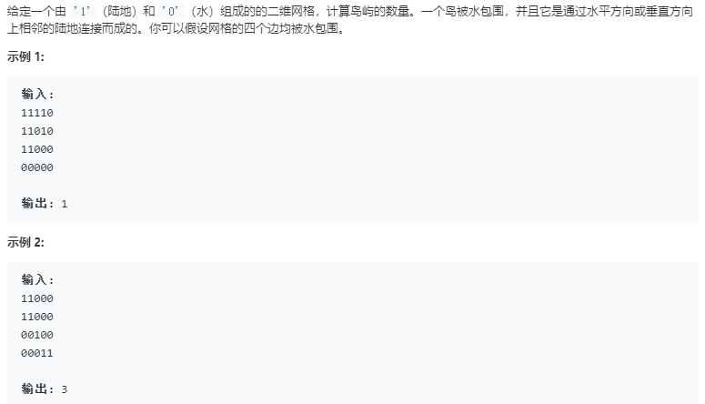
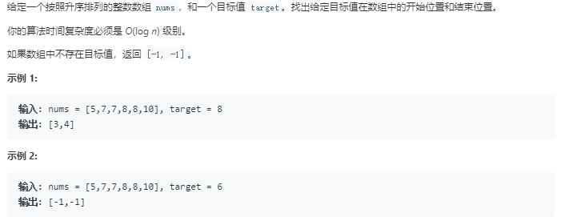
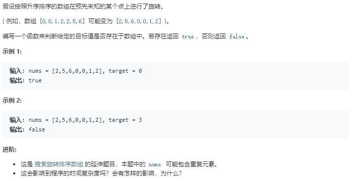
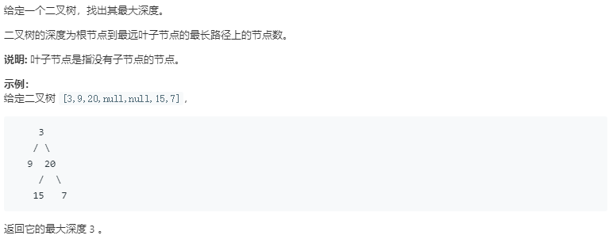
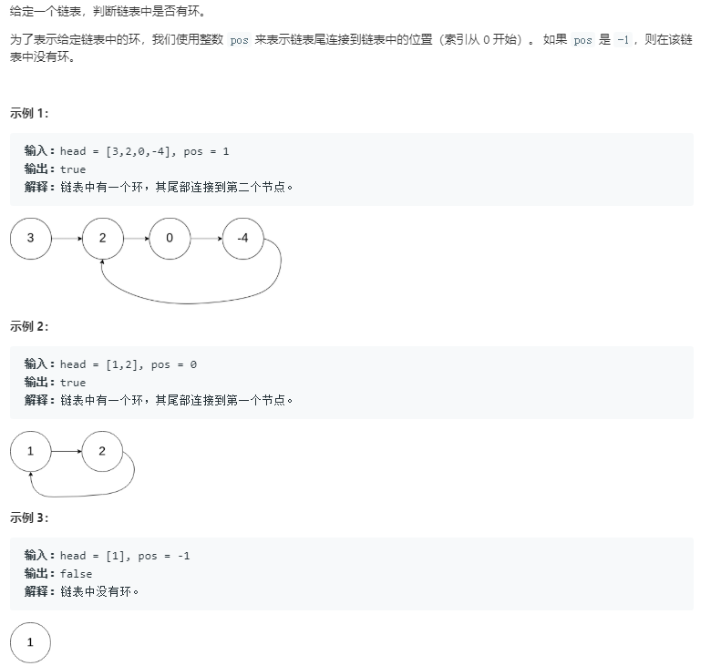

今天你刷题了吗

## OJ平台

### 常见术语

| 简写 | 全称                | 中文         |
| ---- | ------------------- | ------------ |
| OJ   | Online Judge        | 在线判题系统 |
| AC   | Accepted            | 通过         |
| WA   | Wrong Answer        | 答案错误     |
| TLE  | Time Limit Exceed   | 超时         |
| OLE  | Output Limit Exceed | 超过输出限制 |
| MLE  | Memory Limit Exceed | 超内存       |
| RE   | Runtime Error       | 运行时错误   |
| PE   | Presentation Error  | 格式错误     |
| CE   | Compile Error       | 无法编译     |

### 输入问题

牛客网的OJ答题平台，需要自己写输入部分。

```python
'''
Python的输入是野生字符串，所以要自己转类型
strip去掉左右两端的空白符，返回str
slipt把字符串按空白符拆开，返回[str]
map把list里面的值映射到指定类型，返回[type]
EOF用抓异常
https://blog.csdn.net/luovilonia/article/details/40860323
'''

# 有多组输入数据，但没有具体的告诉你有多少组，只是让你对应每组输入，应该怎样输出。
 
while True:
    try:
        a, b = map(int, raw_input().strip().split())
        print a + b,
    except EOFError:
        break
        
# 输入一个整数，告诉我们接下来有多少组数据，然后在输入每组数据的具体值。
 
tcase = int(raw_input().strip())
for case in range(tcase):
    a, b = map(int, raw_input().strip().split())
    print a + b,

# 有多组输入数据，没有具体的告诉你有多少组,但是题目却告诉你遇见什么结束
 
while True:
    a, b = map(int, raw_input().strip().split())
    if a == 0 and b == 0:
        break
    print a + b,

# 输入有多组，并却题目告诉你每组输入遇见什么结束，与第三种不同之处在于，每组输入都有相应的细化。
    
tcase = int(raw_input().strip())
for case in range(tcase):
    a, b = map(int, raw_input().strip().split())
    if a == 0 and b == 0:
        break
    print a + b,

# 这次的输入实现输入一个整数，告诉我们有多少行，在输入每一行。对于每一行的输入，有划分为第一个数和其他的数，第一个数代表那一组数据一共有多少输入。
 
tcase = int(raw_input().strip())
for case in range(tcase):
    data = map(int, raw_input().strip().split())
    n, array = data[0], data[1:]
    
    sum = 0
    for i in range(n):
        sum += array[i]
    print sum,

# 有多种输入数据，对于每组输入数据的第一个数代表该组数据接下来要输入数据量
 
while True:
    try:
        data = map(int, raw_input().strip().split())
        n, array = data[0], data[1:]
            
        sum = 0
        for i in range(n):
            sum += array[i]
        print sum,
    except EOFError:
        raise
       
# 这道题的输出只是简单的在每组输出后边多加一个换行而已！
 
while True:
    try:
        a, b = map(int, raw_input().strip().split())
        print a + b
    except EOFError:
        break

# 这种类型的输出注意的就是换行，这类题目说在输出样例中，每组样例之间有什么什么，所以我们在对应输出的同时要判断一下是否是最后一组输出，如果不是，就 将题目所说的东西输出（一般是换行或空格），如果是，就直接结束。
 
while True:
    data = raw_input().strip()
    if data.isspace():
        break
    else:
        data = map(int, data)
        n, array = data[0], data[1:]
                
        sum = 0
        for i in range(n):
            sum += array[i]
        print sum,
```


## 数组

### 1.两数之和

[1. 两数之和](https://leetcode-cn.com/problems/two-sum/)


```python
class Solution(object):
    def twoSum(self, nums, target):
        """
        :type nums: List[int]
        :type target: int
        :rtype: List[int]
        """
        '''
        #1.O(n^2)
        if not nums:
            return None
        n=len(nums)
        for i in range(n):
            for j in range(i+1,n):
                if nums[j]==target-nums[i]:
                    return [i,j]
        '''
        #2.哈希表 O(n),空间O(n)
        hashmap={}
        for i in range(len(nums)):
            dif=target-nums[i]
            if hashmap.get(dif)!=None and hashmap.get(dif)!=i:
                return [hashmap.get(dif),i]
            hashmap[nums[i]]=i
```

[167. 两数之和 II - 输入有序数组](https://leetcode-cn.com/problems/two-sum-ii-input-array-is-sorted/)


```python
class Solution(object):
    def twoSum(self, numbers, target):
        """
        :type numbers: List[int]
        :type target: int
        :rtype: List[int]
        """
        #双指针法：时间效率O(n),空间效率O(1)
        p1=0
        p2=len(numbers)-1
        while p1<=p2:
            if numbers[p1]+numbers[p2]==target:
                return [p1+1,p2+1]
            elif numbers[p1]+numbers[p2]<target:
                p1=p1+1
            if numbers[p1]+numbers[p2]>target:
                p2=p2-1
        return None
```

[170. 两数之和 III - 数据结构设计](https://leetcode-cn.com/problems/two-sum-iii-data-structure-design/)


```python
class TwoSum(object):

    def __init__(self):
        """
        Initialize your data structure here.
        """
        self.nums=[]
        self.dict={}

    def add(self, number):
        """
        Add the number to an internal data structure..
        :type number: int
        :rtype: None
        """
        self.nums.append(number)
        self.dict[number]=len(self.nums)-1
        

    def find(self, value):
        """
        Find if there exists any pair of numbers which sum is equal to the value.
        :type value: int
        :rtype: bool
        """
        for i in range(len(self.nums)):
            k=value-self.nums[i]
            if k in self.dict and self.dict[k]!=i:
                return True
        return False
        


# Your TwoSum object will be instantiated and called as such:
# obj = TwoSum()
# obj.add(number)
# param_2 = obj.find(value)
```

[653. 两数之和 IV - 输入 BST](https://leetcode-cn.com/problems/two-sum-iv-input-is-a-bst/)


```python
# Definition for a binary tree node.
# class TreeNode(object):
#     def __init__(self, x):
#         self.val = x
#         self.left = None
#         self.right = None

class Solution(object):
    def findTarget(self, root, k):
        """
        :type root: TreeNode
        :type k: int
        :rtype: bool
        """
        #二叉搜素树，中序遍历得到有序数组 O(n)
        path=[]
        self.inorder(root,path)
        p1=0
        p2=len(path)-1
        while p1<p2:
            if path[p1]+path[p2]==k:
                return True
            elif path[p1]+path[p2]<k:
                p1=p1+1
            else:
                p2=p2-1
        return False
        
    def inorder(self,root,path):
        if not root:
            return 
        self.inorder(root.left,path)
        path.append(root.val)
        self.inorder(root.right,path)
```

### 2.寻找重复数

[287. 寻找重复数](https://leetcode-cn.com/problems/find-the-duplicate-number/)


思路：重点在于二分查找值，统计个数

```python
class Solution(object):
    def findDuplicate(self, nums):
        """
        :type nums: List[int]
        :rtype: int
        """
        #类二分查找，O(nlogn)，二分的不是数组下标，而是数值，比较的是数值个数
        start=1
        end=len(nums)-1
        while start<=end:
            mid=(start+end)//2
            count_o=self.countRange(nums,start,mid)
            if start==end:
                if count_o>1:
                    return start
                else:
                    break
            if count_o>(mid-start)+1:
                end=mid
            else:
                start=mid+1
                
                
    def countRange(self,nums,start,end):
        if not nums:
            return 0
        count=0
        for i in range(len(nums)):
            if nums[i]>=start and nums[i]<=end:
                count+=1
        return count
```

### 3.删除重复数字

[26. 删除排序数组中的重复项](https://leetcode-cn.com/problems/remove-duplicates-from-sorted-array/)


```python
class Solution(object):
    def removeDuplicates(self, nums):
        """
        :type nums: List[int]
        :rtype: int
        """
        #双指针
        if nums==None:
            return 0
        if len(nums)==1:
            return 1
            
        p1=1 #快指针
        p2=0 #慢指针
        while(p1<len(nums)):    #快指针的边界
            if nums[p2]!=nums[p1]: #判断**不相等继续
                p2=p2+1
                nums[p2]=nums[p1] #***精华--直接删除
            p1=p1+1               #相等就移动快指针
        return p2+1
```

[80. 删除排序数组中的重复项 II](https://leetcode-cn.com/problems/remove-duplicates-from-sorted-array-ii/)


```python
class Solution(object):
    def removeDuplicates(self, nums):
        """
        :type nums: List[int]
        :rtype: int
        """
        #双指针
        if len(nums)<=2:
            return len(nums)
        p1=2       #前两个一定会保留
        p2=2
        while p1<len(nums):
            if nums[p1]!=nums[p2-2]:
                nums[p2]=nums[p1]
                p2+=1
            p1+=1
        return p2
```

总结：保留k个重复数字

```python
class Solution(object):

    # 模板写法

    def removeDuplicates(self, nums, k):
        """
        :type nums: List[int]
        :rtype: int
        """
        size = len(nums)
        if size <= k:
            return size
        # counter 表示下一个要覆盖的索引
        counter = k
        # 索引为 0 和 1 的数一定会被保留，因此遍历从索引 k 开始
        for i in range(k, size):
            if nums[i] != nums[counter - k]:
                nums[counter] = nums[i]
                counter += 1
        return counter
```


### 4.无重复字符的最长子串

[3. 无重复字符的最长子串](https://leetcode-cn.com/problems/longest-substring-without-repeating-characters/)


思路：滑动窗口

```python
class Solution(object):
    def lengthOfLongestSubstring(self, s):
        """
        :type s: str
        :rtype: int
        """
        #滑动窗口,队列
        if len(s)<=1:
            return len(s)
        result=[]
        cur_len=0
        max_len=0
        for i in range(len(s)):
            cur_len+=1
            while s[i] in result:
                result.pop(0)
                cur_len-=1
            result.append(s[i])
            if cur_len>max_len:
                max_len=cur_len
        return max_len
```

### 5.最短无序连续子数组

[581. 最短无序连续子数组](https://leetcode-cn.com/problems/shortest-unsorted-continuous-subarray/)


```python
class Solution(object):
    def findUnsortedSubarray(self, nums):
        """
        :type nums: List[int]
        :rtype: int
        """
        #1.排序，对应找出第一个及最后一个不同索引
        #2.从前往后记录最大索引区间，从后往前记录最小索引区间
        #数组长度[1,10000]
        high=0
        low=1
        maxValue=0
        minValue=0
        for i in range(len(nums)):
            if i==0:
                maxValue=nums[i]
            if nums[i]<maxValue:
                high=i
            maxValue=max(maxValue,nums[i])
        for i in range(len(nums)-1,-1,-1):
            if i==len(nums)-1:
                minValue=nums[i]
            if nums[i]>minValue:
                low=i
            minValue=min(minValue,nums[i])
        return high-low+1
```

### 6.一手顺子

[846. 一手顺子](https://leetcode-cn.com/problems/hand-of-straights/)


思路：

1.首先判断列表元素个数，不是W的整数倍肯定False
2.元素从小到大排序.sort()方法仅列表类型具备，sorted()方法适用于多种数据类型
3.列表的.remove()方法仅删除遇到的第一个匹配元素，因此从列表的第一个元素开始，相继删除list[0]至list[0]+W的所有元素，删完第一轮代表找出了第一套顺子，接下来不断循环，如果发现list[0]至list[0]+W的某元素不在列表中，表明缺牌，返回FALSE 即可，如果最终列表被删空，说明满足要求，返回True。

```python
class Solution(object):
    def isNStraightHand(self, hand, W):
        """
        :type hand: List[int]
        :type W: int
        :rtype: bool
        """
        if len(hand)%W!=0:
            return False
        hand.sort()
        while len(hand)>0:
            No1=hand[0]
            for j in range(W):
                if No1+j in hand:
                    hand.remove(No1+j)
                    if hand==[]:
                        return True
                else:
                    return False
```

### 7.移动零

[283. 移动零](https://leetcode-cn.com/problems/move-zeroes/)


```python
class Solution(object):
    def moveZeroes(self, nums):
        """
        :type nums: List[int]
        :rtype: None Do not return anything, modify nums in-place instead.
        """
        #快慢指针
        slow=0
        for fast in range(len(nums)):
            if nums[fast]!=0:
                nums[slow],nums[fast]=nums[fast],nums[slow]
                slow+=1
        return nums
```

### 8.盛最多水的容器

[11. 盛最多水的容器](https://leetcode-cn.com/problems/container-with-most-water/)


思路：这种方法背后的思路在于，两线段之间形成的区域总是会受到其中较短那条长度的限制。此外，两线段距离越远，得到的面积就越大。

我们在由线段长度构成的数组中使用两个指针，一个放在开始，一个置于末尾。 此外，我们会使用变量 maxareamaxarea 来持续存储到目前为止所获得的最大面积。 在每一步中，我们会找出指针所指向的两条线段形成的区域，更新 maxareamaxarea，并将指向较短线段的指针向较长线段那端移动一步。

```python
class Solution(object):
    def maxArea(self, height):
        """
        :type height: List[int]
        :rtype: int
        """
        #双指针
        p1=0
        p2=len(height)-1
        maxnum=0
        while p1<p2:
            s=(p2-p1)*min(height[p2],height[p1])
            maxnum=max(maxnum,s)
            if height[p1]<=height[p2]:
                p1+=1
            else:
                p2-=1
        return maxnum
```

### 9.找到消失的数字

[448. 找到所有数组中消失的数字](https://leetcode-cn.com/problems/find-all-numbers-disappeared-in-an-array/)


思路：将所有正数作为数组下标，置对应数组值为负值。那么，仍为正数的位置即为（未出现过）消失的数字。

举个例子：

- 原始数组：[4,3,2,7,8,2,3,1]
- 重置后为：[-4,-3,-2,-7,`8`,`2`,-3,-1]

结论：[8,2] 分别对应的index为[5,6]（消失的数字）

```python
class Solution(object):
    def findDisappearedNumbers(self, nums):
        """
        :type nums: List[int]
        :rtype: List[int]
        """
        #将出现的数字对应位置对应负数，没出现的位置仍未正数
        if not nums:
            return nums
        for i in range(len(nums)):
            nums[abs(nums[i])-1]=-abs(nums[abs(nums[i])-1])
        result=[]
        for i in range(len(nums)):
            if nums[i]>0:
                result.append(i+1)
        return result
```

### 10.反转字符串

[344. 反转字符串](https://leetcode-cn.com/problems/reverse-string/)


```python
class Solution(object):
    def reverseString(self, s):
        """
        :type s: List[str]
        :rtype: None Do not return anything, modify s in-place instead.
        """
        #双指针
        if not s:
            return s
        p1=0
        p2=len(s)-1
        while p1<=p2:
            s[p1],s[p2]=s[p2],s[p1]
            p1+=1
            p2-=1
        return s
```

## 矩阵

### 1.有序矩阵中的查找

[74. 搜索二维矩阵](https://leetcode-cn.com/problems/search-a-2d-matrix/)


思路：二分查找

```python
class Solution(object):
    def searchMatrix(self, matrix, target):
        """
        :type matrix: List[List[int]]
        :type target: int
        :rtype: bool
        """
        #递增排序，二分查找
        #二维矩阵，mid坐标(mid//n,mid%n)
        m=len(matrix)
        if m==0:
            return False
        n=len(matrix[0])
        left=0
        right=m*n-1
        while left<=right:
            mid=(left+right)//2
            mid_value=matrix[mid//n][mid%n]
            if target==mid_value:
                return True
            if target<mid_value:
                right=mid-1
            if target>mid_value:
                left=mid+1
        return False
```

[240. 搜索二维矩阵 II](https://leetcode-cn.com/problems/search-a-2d-matrix-ii/)


```python
class Solution(object):
    def searchMatrix(self, matrix, target):
        """
        :type matrix: List[List[int]]
        :type target: int
        :rtype: bool
        """
        #去行去列查找：以右上角点为基准
        m=len(matrix)
        if m==0:
            return False
        n=len(matrix[0])
        row=0
        col=n-1
        while row<m and col>=0:
            if target==matrix[row][col]:
                return True
            if target<matrix[row][col]:
                col=col-1
            if target>matrix[row][col]:
                row=row+1
        return False
```

### 2.螺旋矩阵

[54. 螺旋矩阵](https://leetcode-cn.com/problems/spiral-matrix/)


```python
class Solution(object):
    def spiralOrder(self, matrix):
        """
        :type matrix: List[List[int]]
        :rtype: List[int]
        """
        row=len(matrix)
        if row==0:
            return None
        col=len(matrix[0])
        left=0
        right=col-1
        top=0
        bottom=row-1
        result=[]
        while left<=right and top<=bottom:
            #form left-to-right
            for i in range(left,right+1):
                result.append(matrix[top][i])
           
            #form top-to-bottom
            for i in range(top+1,bottom+1):
                result.append(matrix[i][right])
            #避免单行
            if top!=bottom:
                #from right-to-left
                for i in range(right-1,left-1,-1):
                    result.append(matrix[bottom][i])
            #避免单列
            if left!=right:
                #from bottom-to-top
                for i in range(bottom-1,top,-1):
                    result.append(matrix[i][left])
            left+=1
            right-=1
            top+=1
            bottom-=1
        return result
```

## 深度优先遍历

### 1.岛屿数量

[200. 岛屿数量](https://leetcode-cn.com/problems/number-of-islands/)



思路：遍历岛这个二维数组，如果当前数为1，则进入感染函数并将岛个数+1

```python
class Solution(object):
    def numIslands(self, grid):
        """
        :type grid: List[List[str]]
        :rtype: int
        """
        #DFS：深度优先
        x_size=len(grid)
        if x_size==0:
            return 0
        y_size=len(grid[0])
        number=0
        for i in range(x_size):
            for j in range(y_size):
                if grid[i][j]=="1":
                    number+=1   
                    self.Infect(i,j,grid)                          
        return number
    def Infect(self,x,y,grid):
        if x<0 or x>=len(grid) or y<0 or y>=len(grid[0]) or grid[x][y]!="1":
            return 
        grid[x][y]=0     #设置flag
        #四个方向探索
        self.Infect(x-1,y,grid)
        self.Infect(x+1,y,grid)
        self.Infect(x,y-1,grid)
        self.Infect(x,y+1,grid)
```


## 查找与排序

### 1.二分查找


```python
class Solution(object):
    def search(self, nums, target):
        """
        :type nums: List[int]
        :type target: int
        :rtype: int
        """
        low=0
        high=len(nums)-1
        while low<=high:
            mid=(low+high)//2
            if nums[mid]==target:
                return mid
            if nums[mid]<target:
                low=mid+1
            if nums[mid]>target:
                high=mid-1
        return -1
```

进阶：在排序数组中查找元素的第一个和最后一个位置

题号：53.在排序数组中查找数字 34. 在排序数组中查找元素的第一个和最后一个位置

题目描述：



```python
class Solution(object):
    def searchRange(self, nums, target):
        """
        :type nums: List[int]
        :type target: int
        :rtype: List[int]
        """
        if nums==[]:
            return [-1,-1]
        first=self.FindFirstK(nums,target)
        last=self.FindLastK(nums,target)
        return [first,last]
        
    def FindFirstK(self, nums, target):
        low=0
        high=len(nums)-1
        while low<=high:
            mid=(low+high)//2
            if nums[mid]==target:
                if mid==0 or (mid>0 and nums[mid-1]!=target):
                    return mid
                else:
                    high=mid-1
            if nums[mid]<target:
                low=mid+1
            if nums[mid]>target:
                high=mid-1
        return -1
    def FindLastK(self, nums, target):
        low=0
        high=len(nums)-1
        length=len(nums)-1
        while low<=high:
            mid=(low+high)//2
            if nums[mid]==target:
                if mid==length or (mid<length and nums[mid+1]!=target):
                    return mid
                else:
                    low=mid+1
            if nums[mid]<target:
                low=mid+1
            if nums[mid]>target:
                high=mid-1
        return -1
```

### 2.Top K问题


215.数组中第K大的元素


```python 
class Solution(object):
    def findKthLargest(self, nums, k):
        """
        :type nums: List[int]
        :type k: int
        :rtype: int
        """
        #快排
        self.Quicksort(nums,0,len(nums)-1)
        print(nums)
        return nums[k-1]
    def Quicksort(self, nums, low, high):
        if low<high:
            left=low
            right=high
            base=nums[low]
            while left<right:
                while left<right and nums[right]<base:
                    right-=1
                while left<right and nums[left]>=base:
                    left+=1
                if left<right:
                    nums[left],nums[right]=nums[right],nums[left]
            nums[low],nums[right]=nums[right],nums[low]
            self.Quicksort(nums,low,right-1)
            self.Quicksort(nums,right+1,high)
```

39.数组中出现次数超过一半的数字

题目：数组中有一个数字出现的次数超过数组长度的一半，请找出这个数字。例如输入一个长度为9的数组{1,2,3,2,2,2,5,4,2}。由于数字2在数组中出现了5次，超过数组长度的一半，因此输出2。如果不存在则输出0。

思路：**快排之后**，处于中间的那个数，如果出现次数超过一半，即为要求的数

```python
# -*- coding:utf-8 -*-
class Solution:
    def MoreThanHalfNum_Solution(self, numbers):
        # write code here
        if not numbers:
            return 0
        self.Quicksort(numbers,0,len(numbers)-1)
        k=numbers[len(numbers)/2]
        flag=self.MorethanHalf(numbers,k)
        if flag:
            return k
        else:
            return 0
    def Quicksort(self,numbers,low,high):
        if low<high:
            left=low
            right=high
            base=numbers[low]
            while left<right:
                while left<right and numbers[right]>base:
                    right-=1
                while left<right and numbers[left]<=base:
                    left+=1
                if left<right:
                    numbers[left],numbers[right]=numbers[right],numbers[left]
            numbers[low],numbers[right]=numbers[right],numbers[low]
            self.Quicksort(numbers,low,right-1)
            self.Quicksort(numbers,right+1,high)
    def MorethanHalf(self,numbers,k):
        flag=0
        num=0
        for i in range(len(numbers)):
            if numbers[i]==k:
                num+=1
        mid=len(numbers)/2
        if num>mid:
            flag=1
        return flag 
```

40.最小的k个数

思路：排序，快排O(nlogn),海量数据时候，选择堆排序(nlogk)。

堆排序思路（大）

(1).将待排序的数组构建出一个大根堆

(2).取出这个大根堆的堆顶节点（最大值）与堆的最下最右的元素进行交换，然后把剩下的元素再构造一个大根堆。

(3).重复第二步，直到这个大根堆的长度为１，此时完成排序。

left=2*root+1

right=2*root+2

```python
# -*- coding:utf-8 -*-
class Solution:
    def GetLeastNumbers_Solution(self, tinput, k):
        # write code here
        #堆排序－－大顶堆
        mlist=[]
        if not tinput or len(tinput)<k or k<=0:
            return mlist
        for i in range(k):
            mlist.append(tinput[i])
        ## 先建立大根堆
        self.BuildHeap(mlist,k)
        
        ## 继续往后搜索，找到k个小的数
        for i in range(k,len(tinput)):
            if tinput[i]<mlist[0]:  ##堆顶是最大的
                mlist[0]=tinput[i]
                self.AdjustHeap(mlist,k,0)      ##调整使得堆顶最大
        ## 把大顶堆排序
        for i in range(k-1,0,-1):
            ##最大值一个个取出来
            mlist[0],mlist[i]=mlist[i],mlist[0]
            self.AdjustHeap(mlist,i,0)
            
        return mlist
            
            
    def BuildHeap(self,heap,n):
        for i in range((n-2)/2,-1,-1): ##从有左右孩子的节点开始
            self.AdjustHeap(heap,n,i)
            
    def AdjustHeap(self,heap,n,root):  ##堆调整
        left=2*root+1
        right=left+1
        larger=root                     ##根节点大于左右子节点
        if left<n and heap[left]>heap[larger]:
            larger=left
        if right<n and heap[right]>heap[larger]:
            larger=right
        if larger!=root:   ##左右节点之一
            heap[larger],heap[root]=heap[root],heap[larger]
            self.AdjustHeap(heap,n,larger)           ##继续往下调整
```

### 3.数据流中的中位数

41.数据流中的中位数（TODO）


### 4.寻找两个有序数组的中位数


```python
class Solution(object):
    def findMedianSortedArrays(self, nums1, nums2):
        """
        :type nums1: List[int]
        :type nums2: List[int]
        :rtype: float
        """
        if not nums1:
            if len(nums2)%2==1:
                return nums2[len(nums2)//2]
            else:
                return (nums2[len(nums2)//2-1]+nums2[len(nums2)//2])/2.0
        if not nums2:
            if len(nums1)%2==1:
                return nums1[len(nums1)//2]
            else:
                return (nums1[len(nums1)//2-1]+nums1[len(nums1)//2])/2.0
        p1=0
        p2=0
        length1=len(nums1)
        length2=len(nums2)
        nums=[]
        while p1<length1 and p2<length2:
            if nums1[p1]<=nums2[p2]:
                nums.append(nums1[p1])
                p1+=1
            else:
                nums.append(nums2[p2])
                p2+=1
        if p1==length1:
            while p2<length2:
                nums.append(nums2[p2])
                p2+=1
        if p2==length2:
            while p1<length1:
                nums.append(nums1[p1])
                p1+=1
        if (length1+length2)%2==1:
            return nums[(length1+length2)//2]
        else:
            return (nums[(length1+length2)//2-1]+nums[(length1+length2)//2])/2.0
```

### 5.合并两个有序数组

思路：两个指针，从前往后，时间效率O(m+n)，空间效率O(m+n)需要借助额外空间

如果，两个指针从后往前，不需要额外的空间。


```python
class Solution(object):
    def merge(self, nums1, m, nums2, n):
        """
        :type nums1: List[int]
        :type m: int
        :type nums2: List[int]
        :type n: int
        :rtype: None Do not return anything, modify nums1 in-place instead.
        """
        #从后往前
        p1=m-1
        p2=n-1
        p=m+n-1
        while p1>=0 and p2>=0:
            if nums1[p1]>=nums2[p2]:
                nums1[p]=nums1[p1]
                p1-=1
            else:
                nums1[p]=nums2[p2]
                p2-=1
            p-=1
        if p2>=0:
            nums1[:p2+1]=nums2[:p2+1]
        return nums1
```

### 6.旋转排序数组中的最小值

[153. 寻找旋转排序数组中的最小值](https://leetcode-cn.com/problems/find-minimum-in-rotated-sorted-array/)


思路：二分法


```python
class Solution(object):
    def findMin(self, nums):
        """
        :type nums: List[int]
        :rtype: int
        """
        #二分查找，O(logn)
        #不存在重复元素
        if not nums:
            return -1
        if len(nums)==1:
            return nums[0]
        p1=0              #前半段
        p2=len(nums)-1    #后半段
        while nums[p1]>nums[p2]: #发生旋转
            if p2-p1==1:
                return nums[p2]
            mid=(p1+p2)//2
            if nums[mid]>nums[p1]: #mid在前半段
                p1=mid
            if nums[mid]<nums[p2]: #mid在后半段
                p2=mid
        return nums[0]
```

[154. 寻找旋转排序数组中的最小值 II](https://leetcode-cn.com/problems/find-minimum-in-rotated-sorted-array-ii/)


思路：二分查找法，但需要考虑特殊，如[2,2,2,2,0,1,2]

```python
class Solution(object):
    def findMin(self, nums):
        """
        :type nums: List[int]
        :rtype: int
        """
        #二分查找O(logn)，特殊情况，顺序查找O(n)
        if not nums:
            return nums
        if len(nums)==1:
            return nums[0]
        p1=0
        p2=len(nums)-1
        while nums[p1]>=nums[p2]:
            if p2-p1==1:
                return nums[p2]
            mid=(p1+p2)//2
            if nums[p1]==nums[mid]==nums[p2]: ##重复很多O(n)
                return min(nums)
            if nums[mid]>=nums[p1]:
                p1=mid
            if nums[mid]<=nums[p2]:
                p2=mid
        return nums[0] #没有旋转
```

### 7.搜索旋转排序数组

[33. 搜索旋转排序数组](https://leetcode-cn.com/problems/search-in-rotated-sorted-array/)


思路：二分查找，先找有序范围，再判断有序范围内有没有，更新left或right指针，不断缩小范围。O(logn)


```python
class Solution(object):
    def search(self, nums, target):
        """
        :type nums: List[int]
        :type target: int
        :rtype: int
        """
        #mid总会出现在有序的一侧
        if not nums:
            return -1
        if len(nums)==1:
            if nums[0]==target:
                return 0
            else:
                return -1
        p1=0
        p2=len(nums)-1
        while p1<=p2:
            mid=(p1+p2)//2
            if nums[mid]==target:
                return mid
            if nums[mid]>=nums[p1]: #在左侧有序区
                if target>=nums[p1] and target<nums[mid]:
                    p2=mid-1
                else:
                    p1=mid+1
            if nums[mid]<=nums[p2]: #z在右侧有序区
                if target>nums[mid] and target<=nums[p2]:
                    p1=mid+1
                else:
                    p2=mid-1
        return -1 
```

[81. 搜索旋转排序数组 II](https://leetcode-cn.com/problems/search-in-rotated-sorted-array-ii/)



思路：方法：二分查找，先找有序范围，再判断有序范围内有没有，更新left或right指针，不断缩小范围

如果a[mid]与a[right]相等，则让right--直到不相等，其余部分与问题Search in Rotated Sorted Array I相同

O(logn)

```python
class Solution(object):
    def search(self, nums, target):
        """
        :type nums: List[int]
        :type target: int
        :rtype: bool
        """
        if not nums:
            return False
        if len(nums)==1:
            if nums[0]==target:
                return True
            else:
                return False
        p1=0
        p2=len(nums)-1
        while p1<=p2:
            mid=(p1+p2)//2
            if target==nums[mid]:
                return True
            elif nums[mid]<nums[p2]:
                if target>nums[mid] and target<=nums[p2]:
                    p1=mid+1
                else:
                    p2=mid-1
            elif nums[mid]>nums[p2]:
                if target>=nums[p1] and target<nums[mid]:
                    p2=mid-1
                else:
                    p1=mid+1
            else:           ###重复元素处理
                p2-=1
        return False
```

### 8.搜索峰值

[162. 寻找峰值](https://leetcode-cn.com/problems/find-peak-element/)


思路：二分查找
过程：
首先要注意题目条件，在题目描述中出现了 nums[-1] = nums[n] = -∞，这就代表着 只要数组中存在一个元素比相邻元素大，那么沿着它一定可以找到一个峰值
根据上述结论，我们就可以使用二分查找找到峰值
查找时，左指针p1，右指针 p2，以其保持左右顺序为循环条件
根据左右指针计算中间位置 m，并比较 m 与 m+1 的值，如果 m 较大，则左侧存在峰值，r = m，如果 m + 1 较大，则右侧存在峰值，l = m + 1
时间复杂度：O(logN)O(logN)

```python
class Solution(object):
    def findPeakElement(self, nums):
        """
        :type nums: List[int]
        :rtype: int
        """
        #二分法：条件是，往旁边大的一侧缩进
        if not nums:
            return nums
        if len(nums)==1:
            return 0
        p1=0
        p2=len(nums)-1
        while p1<p2:
            mid=(p1+p2)//2
            if nums[mid]<nums[mid+1]:
                p1=mid+1
            else:
                p2=mid
        return p1
```

### 9.第一个错误版本

278. [第一个错误的版本](https://leetcode-cn.com/problems/first-bad-version/)


思路：二分查找

```python
# The isBadVersion API is already defined for you.
# @param version, an integer
# @return a bool
# def isBadVersion(version):

class Solution(object):
    def firstBadVersion(self, n):
        """
        :type n: int
        :rtype: int
        """
        #二分查找，O(logn)
        p1=0
        p2=n
        while p1<=p2:
            mid=(p1+p2)//2
            if isBadVersion(mid)==False:
                p1=mid+1
            else:
                p2=mid-1
        return p1
```

### 10.会议室

[252. 会议室](https://leetcode-cn.com/problems/meeting-rooms/)


```python
class Solution(object):
    def canAttendMeetings(self, intervals):
        """
        :type intervals: List[List[int]]
        :rtype: bool
        """
        #先把开始的时间排序，再比较后一个开始的时间是不是在前一个结束之前
        intervals=sorted(intervals,key=lambda s:s[0])     #按关键词排序
        for i in range(1,len(intervals)):
            if intervals[i][0]<intervals[i-1][1]:
                return False
        return True
```


## 字符串

### 1.第一次只出现一次的字符


```python
class Solution(object):
    def firstUniqChar(self, s):
        """
        :type s: str
        :rtype: int
        """
        #haspmap
        result={}
        for i in s:
            if i in result:
                result[i]+=1
            else:
                result[i]=1
        for i in range(len(s)):
            if result[s[i]]==1:
                return i
        return -1
```


## 树

### 1.二叉树的遍历

递归遍历

```python
#前序：根-左-右
def preorder(self,root,path):
    if root==None:
        return
    path.append(root.val)
    self.preorder(root.left,path)
    self.preorder(root.right,path)
#中序：左-根-右
def inorder(self,root,path):
    if root==None:
        return 
    self.inorder(root.left,path)
    path.append(root.val)
    self.inorder(root.right,path)
#后序：左-右-根
def postorder(self,root,path):
    if root==None:
        return
    self.postorder(root.left,path)
    self.postorder(root.right,path)
    path.append(root.val)
```

非递归遍历

[144. 二叉树的前序遍历](https://leetcode-cn.com/problems/binary-tree-preorder-traversal/)

思路：

- 前序遍历的顺序为根-左-右，具体算法为：
- 把根节点push到栈中
- 循环检测栈是否为空，若不空，则取出栈顶元素，保存其值
- 看其右子节点是否存在，若存在则push到栈中
- 看其左子节点，若存在，则push到栈中

```python
# Definition for a binary tree node.
# class TreeNode(object):
#     def __init__(self, x):
#         self.val = x
#         self.left = None
#         self.right = None

class Solution(object):
    def preorderTraversal(self, root):
        """
        :type root: TreeNode
        :rtype: List[int]
        """
        #根-左-右 利用栈
        stack=[]
        path=[]
        if not root:
            return path
        stack.append(root)
        while stack:
            node=stack.pop()
            path.append(node.val)
            if node.right:
                stack.append(node.right)  #先进后出
            if node.left:
                stack.append(node.left)
        return path
```

[94. 二叉树的中序遍历](https://leetcode-cn.com/problems/binary-tree-inorder-traversal/)


思路：

- 中序遍历的顺序为左-根-右，具体算法为：

- 从根节点开始，先将根节点压入栈

- 然后再将其所有左子结点压入栈，取出栈顶节点，保存节点值

- 再将当前指针移到其右子节点上，若存在右子节点，则在下次循环时又可将其所有左子结点压入栈中

  ```python
  # Definition for a binary tree node.
  # class TreeNode(object):
  #     def __init__(self, x):
  #         self.val = x
  #         self.left = None
  #         self.right = None
  
  class Solution(object):
      def inorderTraversal(self, root):
          """
          :type root: TreeNode
          :rtype: List[int]
          """
          stack=[]
          path=[]
          if not root:
              return path
          node=root
          while stack or node:
              if node:
                  stack.append(node)
                  node=node.left
              else:
                  node=stack.pop()
                  path.append(node.val)
                  node=node.right
          return path
  ```

[145. 二叉树的后序遍历](https://leetcode-cn.com/problems/binary-tree-postorder-traversal/)


思路：两个栈-联系前序遍历

后续遍历为左右根，而先序遍历为根左右，可以像先序遍历的那样，做出根右左的结构，先左压左节点进栈，后右节点进栈1，但是不打印，将根右左的结构再压入栈2中，变成左右根，弹出打印，便是后序遍历

```python
# Definition for a binary tree node.
# class TreeNode(object):
#     def __init__(self, x):
#         self.val = x
#         self.left = None
#         self.right = None

class Solution(object):
    def postorderTraversal(self, root):
        """
        :type root: TreeNode
        :rtype: List[int]
        """
        #后序遍历：左-右-根
        #借助两个栈
        path=[]
        stack1=[]
        stack2=[]
        if not root:
            return path
        node=root
        stack1.append(node)
        while stack1:
            node=stack1.pop()
            stack2.append(node)
            if node.left:
                stack1.append(node.left)
            if node.right:
                stack1.append(node.right)
        while stack2:
            path.append(stack2.pop().val)
        return path
```

[102. 二叉树的层次遍历](https://leetcode-cn.com/problems/binary-tree-level-order-traversal/)


思路：利用队列的先进先出(FIFO)特征。每次从队列头部获取一个节点，就将该节点的左右子节点加入队列尾部，如此反复，直到队列为空。分层需要增加行存储

```python
# Definition for a binary tree node.
# class TreeNode(object):
#     def __init__(self, x):
#         self.val = x
#         self.left = None
#         self.right = None

class Solution(object):
    def levelOrder(self, root):
        """
        :type root: TreeNode
        :rtype: List[List[int]]
        """
        path=[]
        if not root:
            return path
        curLayer=[]
        curLayer.append(root)
        while curLayer:
            row=[]
            nextLayer=[]
            for node in curLayer:  #队列：先进先出
                row.append(node.val)
                if node.left:
                    nextLayer.append(node.left)
                if node.right:
                    nextLayer.append(node.right)
            path.append(row)
            curLayer=nextLayer
        return path
```

[103. 二叉树的锯齿形层次遍历](https://leetcode-cn.com/problems/binary-tree-zigzag-level-order-traversal/)(之字形)


思路：偶数行反转python 倒序row[::-1]

```python
# Definition for a binary tree node.
# class TreeNode(object):
#     def __init__(self, x):
#         self.val = x
#         self.left = None
#         self.right = None

class Solution(object):
    def zigzagLevelOrder(self, root):
        """
        :type root: TreeNode
        :rtype: List[List[int]]
        """
        path=[]
        if not root:
            return path
        curLayer=[]
        curLayer.append(root)
        Iseven=True   #偶数行标志
        while curLayer:
            row=[]
            nextLayer=[]
            Iseven=not Iseven
            for node in curLayer:  #队列：先进先出
                row.append(node.val)
                if node.left:
                    nextLayer.append(node.left)
                if node.right:
                    nextLayer.append(node.right)
            if Iseven:
                path.append(row[::-1])
            else:
                path.append(row)
            curLayer=nextLayer
        return path
```

二叉树的垂直遍历(带锁)
Given a binary tree, return the vertical order traversal of its nodes’ values. (ie, from top to bottom, column by column).

If two nodes are in the same row and column, the order should be from left to right.


思路：

- 以根结点的标签为0作为基础，每个节点的左子结点-1，右子节点+1，相同标签的都存在一个vector中；
- 利用map来映射相同标签的vector；
- 利用队列来对每个节点进行处理，同时入队的为绑定标签的节点，用pair来绑定。

```c++
struct BinaryTree {
    int val;
    BinaryTree *left;
    BinaryTree *right;
    BinaryTree(int value) :
        val(value), left(nullptr), right(nullptr) { }
};

vector<vector<int> > verticalOrder(BinaryTree *root) {
    vector<vector<int> > res;
    if (root == nullptr) 
        return res;

    map<int, vector<int>> m;
    queue<pair<int, BinaryTree*>> q;
    q.push({ 0, root });
    while (!q.empty()) {
        auto a = q.front();
        q.pop();
        m[a.first].push_back(a.second->val);
        if (a.second->left)
            q.push({a.first-1, a.second->left});
        if (a.second->right)
            q.push({a.first+1, a.second->right});
    }
    for (auto a : m) {
        res.push_back(a.second);
    }

    return res;
}
```

### 2.二叉搜索树的最近公共祖先

235.[二叉搜索树的最近公共祖先](https://leetcode-cn.com/problems/lowest-common-ancestor-of-a-binary-search-tree/)


思路：这个分割点就是能让节点 p和节点 q 不能在同一颗子树上的那个节点，或者是节点 p 和节点 q中的一个，这种情况下其中一个节点是另一个节点的父亲节点。

```python
# Definition for a binary tree node.
# class TreeNode(object):
#     def __init__(self, x):
#         self.val = x
#         self.left = None
#         self.right = None

class Solution(object):
    def lowestCommonAncestor(self, root, p, q):
        """
        :type root: TreeNode
        :type p: TreeNode
        :type q: TreeNode
        :rtype: TreeNode
        """
        #迭代,利用二叉搜索树的特性
        if not root:
            return None
        p_val=p.val
        q_val=q.val
        node=root
        while node:
            parent_val=node.val
            if p_val<parent_val and q_val<parent_val:
                node=node.left
            elif p_val>parent_val and q_val>parent_val:
                node=node.right
            else:
                return node
        return None
```

### 二叉树的最近公共祖先

[236. 二叉树的最近公共祖先](https://leetcode-cn.com/problems/lowest-common-ancestor-of-a-binary-tree/)


思路：在左、右子树中分别查找是否包含p或q，如果（两种情况：左子树包含p，右子树包含q/左子树包含q，右子树包含p），那么此时的根节点就是最近公共祖先
如果左子树包含p和q，那么到root->left中查找，最近公共祖先在左子树里面
如果右子树包含p和q，那么到root->right中查找，最近公共祖先在右子树里面

```python
# Definition for a binary tree node.
# class TreeNode(object):
#     def __init__(self, x):
#         self.val = x
#         self.left = None
#         self.right = None

class Solution(object):
    def lowestCommonAncestor(self, root, p, q):
        """
        :type root: TreeNode
        :type p: TreeNode
        :type q: TreeNode
        :rtype: TreeNode
        """
        #p,q出现在左、右子树的情况
        if not root or root==p or root==q:
            return root
        left=self.lowestCommonAncestor(root.left,p,q)
        right=self.lowestCommonAncestor(root.right,p,q)
        if not left:
            return right      #p、q在右子树
        if not right:
            return left       #p、q在左子树
        return root
```


### 3.合并二叉树

[617. 合并二叉树](https://leetcode-cn.com/problems/merge-two-binary-trees/)


```python
# Definition for a binary tree node.
# class TreeNode(object):
#     def __init__(self, x):
#         self.val = x
#         self.left = None
#         self.right = None

class Solution(object):
    def mergeTrees(self, t1, t2):
        """
        :type t1: TreeNode
        :type t2: TreeNode
        :rtype: TreeNode
        """
        #递归合并
        if not t1:
            return t2
        if not t2:
            return t1
        newTree=TreeNode(t1.val+t2.val)
        newTree.left=self.mergeTrees(t1.left,t2.left)
        newTree.right=self.mergeTrees(t1.right,t2.right)
        return newTree
```

### 4.翻转二叉树

[226. 翻转二叉树](https://leetcode-cn.com/problems/invert-binary-tree/)


```python
# Definition for a binary tree node.
# class TreeNode(object):
#     def __init__(self, x):
#         self.val = x
#         self.left = None
#         self.right = None

class Solution(object):
    def invertTree(self, root):
        """
        :type root: TreeNode
        :rtype: TreeNode
        """
        if not root:
            return None
        newTree=TreeNode(root.val)
        newTree.right=self.invertTree(root.left)
        newTree.left=self.invertTree(root.right)
        return newTree
```

### 5.二叉树的最大深度

[104. 二叉树的最大深度](https://leetcode-cn.com/problems/maximum-depth-of-binary-tree/)



思路：标签：DFS
找出终止条件：当前节点为空
找出返回值：节点为空时说明高度为0，所以返回0；节点不为空时则分别求左右子树的高度的最大值，同时加1表示当前节点的高度，返回该数值
某层的执行过程：在返回值部分基本已经描述清楚
时间复杂度：O(n)

```python
# Definition for a binary tree node.
# class TreeNode(object):
#     def __init__(self, x):
#         self.val = x
#         self.left = None
#         self.right = None

class Solution(object):
    def maxDepth(self, root):
        """
        :type root: TreeNode
        :rtype: int
        """
        #DFS:递归
        if not root:
            return 0
        else:
            left=self.maxDepth(root.left)
            right=self.maxDepth(root.right)
            return max(left,right)+1
```

### 6.平衡二叉树

[110. 平衡二叉树](https://leetcode-cn.com/problems/balanced-binary-tree/)


思路：左子树是平衡二叉树

右子树是平衡二叉树

左右子树深度不超过1

```python
# Definition for a binary tree node.
# class TreeNode(object):
#     def __init__(self, x):
#         self.val = x
#         self.left = None
#         self.right = None

class Solution(object):
    def isBalanced(self, root):
        """
        :type root: TreeNode
        :rtype: bool
        """
        if root==None:
            return True
        if not self.isBalanced(root.left) or not self.isBalanced(root.right):
            return False

        left=self.maxDepth(root.left)
        right=self.maxDepth(root.right)
        if abs(left-right)<2:
            return True
        else:
            return False
    def maxDepth(self, root):
        if root==None:
            return 0
        left=self.maxDepth(root.left)
        right=self.maxDepth(root.right)
        return max(left,right)+1
```

### 7.把二叉搜索树转换为累加树

[538. 把二叉搜索树转换为累加树](https://leetcode-cn.com/problems/convert-bst-to-greater-tree/)


```python
# Definition for a binary tree node.
# class TreeNode(object):
#     def __init__(self, x):
#         self.val = x
#         self.left = None
#         self.right = None

class Solution(object):
    def convertBST(self, root):
        """
        :type root: TreeNode
        :rtype: TreeNode
        """
        #DFS:逆中序遍历
        '''
         #1.递归
        self.sum=0
        def DFS(root):
            if not root:
                return 
            DFS(root.right)
            self.sum=self.sum+root.val
            root.val=self.sum
            DFS(root.left)
            return root
        return DFS(root)
            
        '''
        #2.非递归，栈
        nsum=0
        node=root
        stack=[]
        while node or len(stack):
            while node:
                stack.append(node)
                node=node.right
            node=stack.pop()
            nsum=nsum+node.val
            node.val=nsum
            node=node.left
        return root
```

### 8.路径总和

[112. 路径总和](https://leetcode-cn.com/problems/path-sum/)


递归/迭代

```python
# Definition for a binary tree node.
# class TreeNode(object):
#     def __init__(self, x):
#         self.val = x
#         self.left = None
#         self.right = None

class Solution(object):
    def hasPathSum(self, root, sum):
        """
        :type root: TreeNode
        :type sum: int
        :rtype: bool
        """
        #递归:DFS
        if not root:
            return False
        sum=sum-root.val
        if not root.left and not root.right and sum==0:
            return True
        return self.hasPathSum(root.left,sum) or self.hasPathSum(root.right,sum)
```

```python
# Definition for a binary tree node.
# class TreeNode(object):
#     def __init__(self, x):
#         self.val = x
#         self.left = None
#         self.right = None

class Solution(object):
    def hasPathSum(self, root, sum):
        """
        :type root: TreeNode
        :type sum: int
        :rtype: bool
        """
        #迭代：栈
        if not root:
            return False
        stack=[]
        stack.append((root,sum-root.val))
        while stack:
            node,cur_sum=stack.pop()
            if not node.left and not node.right and cur_sum==0:
                return True
            if node.left:
                stack.append((node.left,cur_sum-node.left.val))
            if node.right:
                stack.append((node.right,cur_sum-node.right.val))
        return False
```

[113. 路径总和 II](https://leetcode-cn.com/problems/path-sum-ii/)


思路：递归

```python
# Definition for a binary tree node.
# class TreeNode(object):
#     def __init__(self, x):
#         self.val = x
#         self.left = None
#         self.right = None

class Solution(object):
    def pathSum(self, root, sum):
        """
        :type root: TreeNode
        :type sum: int
        :rtype: List[List[int]]
        """
        #DFS:递归
        result=[]
        if not root:
            return result
        def DFS(root,sum,path):
            if not root:
                return
            sum=sum-root.val
            if not root.left and not root.right and sum==0:
                path+=[root.val]
                result.append(path)
                return 
            DFS(root.left,sum,path+[root.val])
            DFS(root.right,sum,path+[root.val])
        DFS(root,sum,[])
        return result
```

[437. 路径总和 III](https://leetcode-cn.com/problems/path-sum-iii/)


```python
# Definition for a binary tree node.
# class TreeNode(object):
#     def __init__(self, x):
#         self.val = x
#         self.left = None
#         self.right = None

class Solution(object):
    def __init__(self):
        self.pathnumber=0
    def pathSum(self, root, sum):
        """
        :type root: TreeNode
        :type sum: int
        :rtype: int
        """
        #双重递归，先递归所有根节点的路径，再递归每一个条路上的节点
        if not root:
            return self.pathnumber
        self.Sum(root,sum)
        self.pathSum(root.left,sum)
        self.pathSum(root.right,sum)
        return self.pathnumber
    def Sum(self,root,sum):
            #计算该节点处的路径条数
            if not root:
                return 
            sum=sum-root.val
            if sum==0:
                self.pathnumber+=1
            self.Sum(root.left,sum)
            self.Sum(root.right,sum)    
```

### 9.对称二叉树

[101. 对称二叉树](https://leetcode-cn.com/problems/symmetric-tree/)


思路：左右对称。

```python
class Solution(object):
    def isSymmetric(self, root):
        """
        :type root: TreeNode
        :rtype: bool
        """
        #镜像
        #递归
        return self.isMirror(root,root)
    def isMirror(self,p1,p2):
        if not p1 and not p2:
            return True
        if not p1 or not p2:
            return False
        if p1.val!=p2.val:
            return False
        else:
            return self.isMirror(p1.left,p2.right) and self.isMirror(p1.right,p2.left)   
```

```python
        #迭代：队列，连续两个值相等
        queue=[]
        queue.append(root)
        queue.append(root)
        while len(queue)!=0:
            p1=queue.pop()
            p2=queue.pop()
            if not p1 and not p2:
                continue
            if not p1 or not p2:
                return False
            if p1.val!=p2.val:
                return False
            else:
                queue.append(p1.left)
                queue.append(p2.right)
                queue.append(p1.right)
                queue.append(p2.left)
        return True
```

### 10.前序中序构建二叉树

[105. 从前序与中序遍历序列构造二叉树](https://leetcode-cn.com/problems/construct-binary-tree-from-preorder-and-inorder-traversal/)


```python
# Definition for a binary tree node.
# class TreeNode(object):
#     def __init__(self, x):
#         self.val = x
#         self.left = None
#         self.right = None

class Solution(object):
    def buildTree(self, preorder, inorder):
        """
        :type preorder: List[int]
        :type inorder: List[int]
        :rtype: TreeNode
        """
        if not inorder: return
        root = TreeNode(preorder.pop(0))
        i = inorder.index(root.val)
        root.left = self.buildTree(preorder, inorder[:i])
        root.right = self.buildTree(preorder, inorder[i+1:])
        return root
```

### 11.二叉树展开链表

[114. 二叉树展开为链表](https://leetcode-cn.com/problems/flatten-binary-tree-to-linked-list/)


```python
# Definition for a binary tree node.
# class TreeNode(object):
#     def __init__(self, x):
#         self.val = x
#         self.left = None
#         self.right = None

class Solution(object):
    def flatten(self, root):
        """
        :type root: TreeNode
        :rtype: None Do not return anything, modify root in-place instead.
        """
        if not root:
            return 
        #左子树拉直
        self.flatten(root.left)
        #右子树拉直
        self.flatten(root.right)
        #记录右子树
        tmp=root.right
        #左子树转移
        root.right=root.left
        #左子树置null
        root.left=None
        #找到最右点
        while root.right!=None:
            root=root.right
        #把之前的右串拼接上
        root.right=tmp
```


## 链表

### 1.反转链表

题号：14 反转链表  206. 反转链表1

题目描述：输入一个链表，反转链表后，输出新链表的表头。

思路：主要为了防止链表在i点断开，需要记录前一个指针，当前指针，后一个指针

当前节点是pCur，pPre为当前节点的前一节点，pNext为当前节点的下一节点
需要pPre和pNext的目的是让当前节点从pPre->pCur->PNext1->pNext2变成pPre<-pCur PNext1->pNext2
即pPre让节点可以反转所指方向，但反转之后如果不用PNext节点保存next1节点的话，此单链表就此断开了
所以需要用到pPre和pNext两个节点
1->2->3->4->5
1<-2<-3 4->5

```python
# -*- coding:utf-8 -*-
# class ListNode:
#     def __init__(self, x):
#         self.val = x
#         self.next = None
class Solution:
    # 返回ListNode
    def ReverseList(self, pHead):
        # write code here
        if pHead==None or pHead.next==None:
            return pHead
        
        pPre=None
        pCur=pHead
        pNext=None
        
        while(pCur!=None):
            pNext=pCur.next  ##记录下一个节点
            pCur.next=pPre   ##改变指向
            
            pPre=pCur        ##移动一个指针
            pCur=pNext
        return pPre
```

**反转链表 2**

题号：92 反转链表2

题目描述：反转从位置 *m* 到 *n* 的链表。请使用一趟扫描完成反转。

说明:
1 ≤ m ≤ n ≤ 链表长度。

示例:

输入: 1->2->3->4->5->NULL, m = 2, n = 4
输出: 1->4->3->2->5->NULL

题目思路：需要记录m-1，m处的指针。中间部分正常反转，然后改变next方向

```python
# Definition for singly-linked list.
# class ListNode(object):
#     def __init__(self, x):
#         self.val = x
#         self.next = None

class Solution(object):
    def reverseBetween(self, head, m, n):
        """
        :type head: ListNode
        :type m: int
        :type n: int
        :rtype: ListNode
        """
        if m==n:
            return head
        mCur=None #m值
        mPre=None #m前一个值
        newHead=ListNode(0)
        newHead.next=head
        cur=newHead
        i=0
        while i<m:
            mPre=cur
            cur=cur.next
            i+=1
        mCur=cur
        pre=cur
        cur=cur.next
        
        nNext=None #n的下一个值
        while i<n:  #开始反转
            nNext=cur.next
            cur.next=pre
            
            pre=cur
            cur=nNext
            i+=1
        mPre.next=pre  #第n个节点
        mCur.next=nNext #第n+1个节点
        return newHead.next
```

### 2.从尾到头打印链表

题号：6 剑指offer

题目描述：输入一个链表，按链表值从尾到头的顺序返回一个ArrayList。

思路：栈的思想，先入后出

```python
# -*- coding:utf-8 -*-
# class ListNode:
#     def __init__(self, x):
#         self.val = x
#         self.next = None

class Solution:
    # 返回从尾部到头部的列表值序列，例如[1,2,3]
    def printListFromTailToHead(self, listNode):
        # write code here
        ## 入栈，出栈
        stack1=[]
        stack2=[]
        if listNode==None:
            return stack2
        p=listNode
        while p!=None:
            stack1.append(p.val)
            p=p.next
        while len(stack1)!=0:
            stack2.append(stack1.pop())
        return stack2
```

### 3.删除链表中的节点

题号：18 删除链表中的节点 237. 删除链表中的节点

237.删除链表中的节点


注意：只给了要求被删除的节点

思路：把要删除那个节点的值换成下一个节点值，next也换next.next

```python
# Definition for singly-linked list.
# class ListNode(object):
#     def __init__(self, x):
#         self.val = x
#         self.next = None

class Solution(object):
    def deleteNode(self, node):
        """
        :type node: ListNode
        :rtype: void Do not return anything, modify node in-place instead.
        """
        ## 只给要删除的节点(非尾节点)
        if node.next!=None:
            node.val=node.next.val
            if node.next.next==None:
                node.next=None
            else:
                node.next=node.next.next
```

18 删除链表的节点

在O(1)时间内删除链表节点。给定单向链表的头指针和一个节点指针，定义一个函数在O(1)时间内删除该节点。

思路：(1)O(n)遍历找到要删除的节点的前一个节点，再把下一个节点链接过来。。

​         （2）O(1)把要删除的节点的下一个节点的内容复制过来，再把下一个节点的下一个节点链接过来。

```python
# -*- coding:utf-8 -*-
# class ListNode:
#     def __init__(self, x):
#         self.val = x
#         self.next = None
class Solution:
    def deleteNode(self, pHead, pDNode):
        ##只有一个节点
        if pHead==pDNode:
            pHead==None
            return pHead
        ##要删除是尾节点，只能顺序查找，把前一个节点的下一个节点指向None
        if pDNode.next==None:
            pNode=pHead
            while(pNode.next!=pDNode):
                pNode=pNode.next
            pNode.next=None
            return pHead
        pDNode.val=pDNode.next.val
        if pDnode.next.next==None:
                pDnode.next=None
            else:
                pDnode.next=pDnode.next.next
        return pHead       
```

### 4.删除列表中的重复节点

83删除排序链表中的重复元素1


思路：保留重复的节点，两指针

```python
# Definition for singly-linked list.
# class ListNode(object):
#     def __init__(self, x):
#         self.val = x
#         self.next = None

class Solution(object):
    def deleteDuplicates(self, head):
        """
        :type head: ListNode
        :rtype: ListNode
        """
        #保留重复节点
        if head==None or head.next==None:
            return head
        cur=head
        nex=None
        while cur!=None and cur.next!=None:
            nex=cur.next
            if cur.val==nex.val: #当前值和下一个值相同
                while(nex!=None and cur.val==nex.val):#继续搜索
                    nex=nex.next
            cur.next=nex
            cur=nex
        return head
```

82.删除排序链表中的重复元素 II


思路：重复的点不保留，三指针法


```python
# Definition for singly-linked list.
# class ListNode(object):
#     def __init__(self, x):
#         self.val = x
#         self.next = None

class Solution(object):
    def deleteDuplicates(self, head):
        """
        :type head: ListNode
        :rtype: ListNode
        """
        #重复链表不保留
        #三指针
        if head==None or head.next==None:
            return head
        newhead=ListNode(0)
        newhead.next=head
        pre=newhead
        cur=head
        nex=None
        while cur!=None and cur.next!=None:
            nex=cur.next
            if cur.val==nex.val: #找到第一个重复节点
                while nex!=None and cur.val==nex.val: #重复查找
                    nex=nex.next
                pre.next=nex
                cur=nex
            else:
                pre=cur
                cur=nex
        return newhead.next
```

### 5.删除链表中倒数第k个节点

题号 18 删除链表中倒数第k个节点 19. 删除链表的倒数第N个节点

剑指offer,找到倒数k(简单)

题目描述：输入一个链表，输出该链表中倒数第k个结点

|      |      |      | 倒数k |      |      |
| ---- | ---- | ---- | ----- | ---- | ---- |
| 1    | 2    | 3    | 4     | 5    | 6    |

倒数第k个，是正数第n-k+1

思路：(1)把倒数变成正数，先遍历一次，得到n,再遍历n-k+1步

(2) 快慢指针问题：只需遍历一次，两个指针，如果一个走到最后一个，一个走到了倒数第k个，则两者相差n-(n-k+1)=k-1个步长。所以一个先走k-1步皆可。(注意：k不能比链表长度大)

```python
# -*- coding:utf-8 -*-
# class ListNode:
#     def __init__(self, x):
#         self.val = x
#         self.next = None

class Solution:
    def FindKthToTail(self, head, k):
        # write code here
        if head==None or k==0:
            return None
        ##两个相差k-1的指针
        pAhead=head
        pBehind=None
        ##第一个指针走k-1步
        for i in range(0,k-1,1):
            if(pAhead.next!=None):  ##保证k不能比链表长度长
                pAhead=pAhead.next
            else:
                return None
        pBehind=head
        while(pAhead.next!=None):
            pAhead=pAhead.next
            pBehind=pBehind.next
        return pBehind
```

leetcode:删除


思路：删除倒数第N个节点

```python
# class ListNode(object):
#     def __init__(self, x):
#         self.val = x
#         self.next = None

class Solution(object):
    def removeNthFromEnd(self, head, n):
        """
        :type head: ListNode
        :type n: int
        :rtype: ListNode
        """
        #要求一遍扫描
        #快慢指针，快走n步
        #倒数第n个数,正数应该是N-n+1
        #两指针相差N-(N-n+1)=n-1 删除n,希望得到其前面一个数，相差n
        if head==None or n==0 or head.next==None:
            return None
        newhead=ListNode(0)
        newhead.next=head   ##防止删除第一个节点
        pFast=newhead
        pSlow=newhead
        for i in range(n):
            if pFast!=None:  #保证n合理
                pFast=pFast.next
            else:
                return None
        while(pFast.next!=None):
            pFast=pFast.next
            pSlow=pSlow.next

        pSlow.next=pSlow.next.next
        return newhead.next
```

### 6.两个链表的第一个公共节点

题号：52.两个链表的第一个公共节点

题目：输入两个链表，找到它们的第一个公共节点。


思路：(1)暴力解法：在第一个链表上顺序遍历每一个节点，每遍历一个节点，就在第二个链表上顺序遍历每一个节点。找到相等的节点，即为公共节点。时间复杂度O(m*n)。

(2)栈：后进先出。从链表尾部考虑，重合以后节点相同。故从尾部弹出，相同继续，不相同就是公共节点。时间复杂度O(m+n),空间复杂度O(m+n)。

(3)指针法：先各自遍历得到链表的长度，然后长的先走差的长度，再一起走，相同点就是公共节点。

```python
# -*- coding:utf-8 -*-
# class ListNode:
#     def __init__(self, x):
#         self.val = x
#         self.next = None
class Solution:
    def FindFirstCommonNode(self, pHead1, pHead2):
        # write code here
        if pHead1==None or pHead2==None:
            return None
        length1=self.Getlength(pHead1)
        length2=self.Getlength(pHead2)
        if length1>=length2:
            diff=length1-length2
            p1=pHead1
            p2=pHead2
        else:
            diff=length2-length1
            p1=pHead2
            p2=pHead1
        #长的先走
        for i in range(diff):
            p1=p1.next
        #一起走
        while p1!=None and p2!=None and p1!=p2:
            p1=p1.next
            p2=p2.next
        return p1
            
    def Getlength(self,pHead):
        length=0
        while(pHead!=None):
            length+=1
            pHead=pHead.next
        return length
```


### 7.合并两个排序链表


思路：两个指针


```python
# Definition for singly-linked list.
# class ListNode(object):
#     def __init__(self, x):
#         self.val = x
#         self.next = None

class Solution(object):
    def mergeTwoLists(self, l1, l2):
        """
        :type l1: ListNode
        :type l2: ListNode
        :rtype: ListNode
        """
        newhead=ListNode(0)
        cur=newhead
        p1=l1
        p2=l2
        while p1!=None and p2!=None:
            if p1.val<=p2.val:
                cur.next=p1
                p1=p1.next
            else:
                cur.next=p2
                p2=p2.next
            cur=cur.next
        if p1==None:
            cur.next=p2
        if p2==None:
            cur.next=p1
        return newhead.next
```

拓展：23. 合并K个排序链表

思路：分-治思想,时间复杂度O(NlogK),空间复杂度O(1)


```python
# Definition for singly-linked list.
# class ListNode(object):
#     def __init__(self, x):
#         self.val = x
#         self.next = None

class Solution(object):
    def mergeKLists(self, lists):
        """
        :type lists: List[ListNode]
        :rtype: ListNode
        """
        ##采用分-治
        length=len(lists)
        if length==0:
            return None
        if length==1:
            return lists[0]
        if length==2:
            return self.partLists(lists[0],lists[1])
        mid=int(length/2)
        left=self.mergeKLists(lists[0:mid])
        right=self.mergeKLists(lists[mid:length])
        result=self.partLists(left,right)
        return result
    def partLists(self,l1,l2):  #两个排序链表合并
        newhead=ListNode(0)
        cur=newhead
        p1=l1
        p2=l2
        while p1!=None and p2!=None:
            if p1.val<=p2.val:
                cur.next=p1
                p1=p1.next
            else:
                cur.next=p2
                p2=p2.next
            cur=cur.next
        if p1==None:
            cur.next=p2
        if p2==None:
            cur.next=p1
        return newhead.next
```

### 8.有环链表问题

题号：23.链表中环的入口节点 141 142环形链表



思路：快慢指针，快的追上慢的有环

```python
# Definition for singly-linked list.
# class ListNode(object):
#     def __init__(self, x):
#         self.val = x
#         self.next = None

class Solution(object):
    def hasCycle(self, head):
        """
        :type head: ListNode
        :rtype: bool
        """
        #快慢指针-快的追上慢的指针，有环
        if head==None:
            return False
        pSlow=head.next
        if pSlow==None:
            return False
        pFast=pSlow.next
        while pFast!=None and pSlow!=None:
            if pFast==pSlow:
                return True
            pSlow=pSlow.next
            pFast=pFast.next
            if pFast!=None:  #多走一步
                pFast=pFast.next
        return False
```

142.链表中环的入口节点


思路：(1)先判断有没有环,一快一慢指针，如果相遇，有环，且相遇点在环内

(2)计算环的长度

(3)再次两个指针，一个先走环的长度，则一起走后，相遇点就是入口。

```python
# Definition for singly-linked list.
# class ListNode(object):
#     def __init__(self, x):
#         self.val = x
#         self.next = None

class Solution(object):
    def detectCycle(self, head):
        """
        :type head: ListNode
        :rtype: ListNode
        """
        #三步法
        #是否有环
        #环的长度
        #环的第一个节点
        meetnode=self.hasCycle(head)
        if meetnode==None:
            return None
        #计算环的长度，相遇节点在环内
        cycleLength=1
        p1=meetnode.next
        while p1!=meetnode:
            cycleLength+=1
            p1=p1.next
        #环的第一个节点，快先走环的长度，再相遇
        p1=head
        p2=head
        for i in range(cycleLength):
            p1=p1.next
        while p1!=p2:
            p1=p1.next
            p2=p2.next
        return p1
         
    def hasCycle(self,head):
        if head==None:
            return None
        pSlow=head.next
        if pSlow==None:
            return None
        pFast=pSlow.next
        while pFast!=None and pSlow!=None:
            if pFast==pSlow:
                return pFast
            pSlow=pSlow.next
            pFast=pFast.next
            if pFast!=None:
                pFast=pFast.next
        return None
```

### 9.复杂链表的复制

题号：35 复杂链表的复制 138复制带随机指针的链表

题目描述：输入一个复杂链表（每个节点中有节点值，以及两个指针，一个指向下一个节点，另一个特殊指针指向任意一个节点），返回结果为复制后复杂链表的head。（注意，输出结果中请不要返回参数中的节点引用，否则判题程序会直接返回空）


class RandomListNode:

def __init__(self, x):

self.label = x

self.next = None

self.random = None

(1)直观想法：第一步：复制原始链表的每个节点，用next连接；第二步：设置每个节点random。需要遍历链表两遍，时间复杂度O(n^2)

(2)空间换时间，hashmap,遍历一次的时候，记录random, 空间复杂度O(n)

(3)只需遍历一次，而且不需要额外空间。分三步。

第一步：创建新的节点----长链表

第二步：设置random

第三步：长链表拆分


```python
# -*- coding:utf-8 -*-
# class RandomListNode:
#     def __init__(self, x):
#         self.label = x
#         self.next = None
#         self.random = None
class Solution:
    # 返回 RandomListNode
    def Clone(self, pHead):
        # write code here
        self.CloneNodes(pHead)
        self.ConnectRandom(pHead)
        return self.DisConnect(pHead)
    def CloneNodes(self,pHead):
        pNode=pHead
        #新建复杂节点
        while(pNode!=None):
            #复制
            cloneNode=RandomListNode(0)
            cloneNode.label=pNode.label
            cloneNode.next=pNode.next
            cloneNode.random=None
            #链接
            pNode.next=cloneNode
            #下一个节点
            pNode=cloneNode.next
    def ConnectRandom(self,pHead):
        pNode=pHead
        #复制Random
        while(pNode!=None):
            cloneNode=pNode.next
            if pNode.random!=None:
                cloneNode.random=pNode.random.next
            pNode=cloneNode.next
    def DisConnect(self,pHead):
        #复制的头节点
        pNode=pHead
        pCloneHead=None
        pCloneNode=None
        if pNode!=None:
            pCloneHead=pCloneNode=pNode.next
            pNode.next=pCloneNode.next
            pNode=pNode.next
        while(pNode!=None):
            pCloneNode.next=pNode.next
            pCloneNode=pCloneNode.next
            pNode.next=pCloneNode.next
            pNode=pNode.next
        return pCloneHead
```

### 10.两数相加

题号：2.两数相加

题目描述：逆序


思路：初等数学


```python
# Definition for singly-linked list.
# class ListNode(object):
#     def __init__(self, x):
#         self.val = x
#         self.next = None

class Solution(object):
    def addTwoNumbers(self, l1, l2):
        """
        :type l1: ListNode
        :type l2: ListNode
        :rtype: ListNode
        """
        #低位相加
        newhead=ListNode(0)
        pNode=newhead
        p1=l1
        p2=l2
        flag=0
        while p1!=None or p2!=None:
            if p1==None:
                x=0
            else:
                x=p1.val
            if p2==None:
                y=0
            else:
                y=p2.val
            sum_n=flag+x+y
            flag=sum_n/10
            pNode.next=ListNode(sum_n%10)
            pNode=pNode.next
            if p1!=None:
                p1=p1.next
            if p2!=None:
                p2=p2.next
        if flag:
            pNode.next=ListNode(flag)
        return newhead.next
```

题目：正序


思路：借用栈的先进后出变为逆序

```python
# Definition for singly-linked list.
# class ListNode(object):
#     def __init__(self, x):
#         self.val = x
#         self.next = None

class Solution(object):
    def addTwoNumbers(self, l1, l2):
        """
        :type l1: ListNode
        :type l2: ListNode
        :rtype: ListNode
        """
        #利用栈解决
        p1=l1
        p2=l2
        stack1=[]
        stack2=[]
        stack3=[]
        while(p1!=None):
            stack1.append(p1.val)
            p1=p1.next
        while(p2!=None):
            stack2.append(p2.val)
            p2=p2.next
        newhead=ListNode(0)
        pNode=newhead
        flag=0
        while len(stack1)!=0 or len(stack2)!=0:
            if len(stack1)==0:
                x=0
            else:
                x=stack1.pop()
            
            if len(stack2)==0:
                y=0
            else:
                y=stack2.pop()
            sum_n=flag+x+y
            flag=sum_n/10
            stack3.append(sum_n%10)
        if flag:
            stack3.append(flag)
        while len(stack3)!=0:
            pNode.next=ListNode(stack3.pop())
            pNode=pNode.next
        return newhead.next
```

### 11.奇偶链表

题目描述：


思路：奇偶分离


```python
# Definition for singly-linked list.
# class ListNode(object):
#     def __init__(self, x):
#         self.val = x
#         self.next = None

class Solution(object):
    def oddEvenList(self, head):
        """
        :type head: ListNode
        :rtype: ListNode
        """
        if head==None or head.next==None:
            return head
        podd=head
        pevenhead=peven=podd.next
        
        while podd.next!=None and peven.next!=None:
                podd.next=peven.next
                podd=podd.next
                peven.next=podd.next
                peven=peven.next
        podd.next=pevenhead
        return head
```

### 12.回文链表

题号：234.回文链表

题目描述：


```python
# Definition for singly-linked list.
# class ListNode(object):
#     def __init__(self, x):
#         self.val = x
#         self.next = None

class Solution(object):
    def isPalindrome(self, head):
        """
        :type head: ListNode
        :rtype: bool
        """
        '''
        #简单粗暴，栈
        if head==None or head.next==None:
            return True
        stack=[]
        pNode=head
        while pNode!=None:
            stack.append(pNode.val)
            pNode=pNode.next
        mid=len(stack)/2
        pNode=head
        for i in range(mid):
            if pNode.val==stack.pop():
                pNode=pNode.next
            else:
                return False
        return True
        '''
        #进阶:快慢指针，找到中点
        if head==None or head.next==None:
            return True
        pFast=head
        pSlow=head
        while pFast!=None:
            pFast=pFast.next
            if pFast!=None: ##奇偶长度
                pFast=pFast.next
            pSlow=pSlow.next
        #后半部分要反转
        pSlow=self.reverse(pSlow)
        p=head
        while pSlow!=None:
            if pSlow.val==p.val:
                pSlow=pSlow.next
                p=p.next
            else:
                return False
        return True
    def reverse(self,head):
        cur=head
        pre=None
        nex=None
        while cur!=None:
            nex=cur.next
            cur.next=pre
                
            pre=cur
            cur=nex
        return pre
```

### 13.排序链表

[148. 排序链表](https://leetcode-cn.com/problems/sort-list/)


思路：归并排序

```python
# Definition for singly-linked list.
# class ListNode(object):
#     def __init__(self, x):
#         self.val = x
#         self.next = None

class Solution(object):
    def sortList(self, head):
        """
        :type head: ListNode
        :rtype: ListNode
        """
        #归并排序：先二分再合并
        #1.找到中点 2.一分为二 3.排序结合
        #递归终止条件
        if not head or not head.next:
            return head
        #找到中点，而且要断开
        pre,slow,fast=head,head,head
        while fast and fast.next:
            pre=slow
            slow=slow.next
            fast=fast.next.next
        pre.next=None #断开
        left=self.sortList(head)
        right=self.sortList(slow)
        return self.merge(left,right)
        
    def merge(self,p1,p2):
        if not p1:
            return p2
        if not p2:
            return p1
        if p1.val<p2.val:
            head=ListNode(p1.val)
            head.next=self.merge(p1.next,p2)
        else:
            head=ListNode(p2.val)
            head.next=self.merge(p1,p2.next)
        return head
```

## 贪婪算法

贪婪算法：用数学方式证明每一步选择都是最优的。时间，空间复杂度O(1)

### 1.股票买卖

[122. 买卖股票的最佳时机 II](https://leetcode-cn.com/problems/best-time-to-buy-and-sell-stock-ii/)


思路：多次交易~

贪心算法，一次遍历，只要今天价格小于明天价格就在今天买入然后明天卖出，时间复杂度`O(n)`

```python
class Solution(object):
    def maxProfit(self, prices):
        """
        :type prices: List[int]
        :rtype: int
        """
        #贪婪算法
        result=0
        if len(prices)<=0:
            return result
        for i in range(1,len(prices)):
            if prices[i]>prices[i-1]:
                result+=prices[i]-prices[i-1]
        return result   
```

## 动态规划

动态规划特征：
①求一个问题的最优解； 
②整体的问题的最优解是依赖于各个子问题的最优解； 
③小问题之间还有相互重叠的更小的子问题； 
④从上往下分析问题，从下往上求解问题；

应用动态规划时候，每一步都可能面临若干选择。时间复杂度O（n^2），空间复杂度O(n)

### 1.爬楼梯

[70. 爬楼梯](https://leetcode-cn.com/problems/climbing-stairs/)


```python
class Solution(object):
    def climbStairs(self, n):
        """
        :type n: int
        :rtype: int
        """
        #一维DP
        dp=[0]*(n+1)
        dp[0]=0
        dp[1]=1
        if n==1:
            return dp[1]
        dp[2]=2
        for i in range(3,n+1):
            dp[i]=dp[i-1]+dp[i-2]
        return dp[n]
```

青蛙变态跳台阶问题

题目描述：一只青蛙一次可以跳上1级台阶，也可以跳上2级……它也可以跳上n级。求该青蛙跳上一个n级的台阶总共有多少种跳法。

思路：数学归纳法

```python
# -*- coding:utf-8 -*-
class Solution:
    def jumpFloorII(self, number):
        # write code here
        if number<=0:
            return 0
        else:
            return pow(2,number-1)
```

矩阵覆盖

题目描述：我们可以用2x1的小矩形横着或者竖着去覆盖更大的矩形。请问用n个2x1的小矩形无重叠地覆盖一个2*n的大矩形，总共有多少种方法？

思路：

```python
# -*- coding:utf-8 -*-
class Solution:
    def rectCover(self, number):
        # write code here
        ##斐波那契数列
        if number<=2:
            return number
        else:
            firstNumber=1
            twoNumber=2
            for i in range(3,number+1):
                rectnumber=twoNumber+firstNumber
                firstNumber=twoNumber
                twoNumber=rectnumber
            return rectnumber
```

### 2.最大子序和

[53. 最大子序和](https://leetcode-cn.com/problems/maximum-subarray/)


```python
class Solution(object):
    def maxSubArray(self, nums):
        """
        :type nums: List[int]
        :rtype: int
        """
        #一维DP
        #dp[i]前i处的最大和
        dp=[0]*len(nums)    
        dp[0]=nums[0]
        dpmax=dp[0]
        for i in range(1,len(nums)):
            if nums[i]<dp[i-1]+nums[i]:
                dp[i]=dp[i-1]+nums[i]
            else:
                dp[i]=nums[i]
            if dp[i]>dpmax:
                dpmax=dp[i]
        return dpmax
```

### 3.使用最小花费爬楼梯

[746. 使用最小花费爬楼梯](https://leetcode-cn.com/problems/min-cost-climbing-stairs/)


```python
class Solution(object):
    def minCostClimbingStairs(self, cost):
        """
        :type cost: List[int]
        :rtype: int
        """
        #dp[i]代表到i位置的最小花费
        #状态转移：dp[i]=min(dp[i-1],dp[i-2])+cost[i]
        n=len(cost)
        dp=[0]*n
        dp[0]=cost[0]
        dp[1]=cost[1]
        for i in range(2,n):
            dp[i]=min(dp[i-1],dp[i-2])+cost[i]
        return min(dp[n-2],dp[n-1])
```

### 4.比特位计算

[338. 比特位计数](https://leetcode-cn.com/problems/counting-bits/)


```python
class Solution(object):
    def countBits(self, num):
        """
        :type num: int
        :rtype: List[int]
        """
        #找规律：
        #偶数：dp[i]=dp[i//2]
        #奇数：dp[i]=dp[i//2]+1  
        dp=[0]*(num+1)
        for i in range(1,num+1):
            if i%2==0:
                dp[i]=dp[i//2]
            else:
                dp[i]=dp[i//2]+1
        return dp
```

### 5.大礼包

[638. 大礼包](https://leetcode-cn.com/problems/shopping-offers/)


思路：DFS

状态转移：curprice=self.shoppingOffers(price,special,needs_remain)+m_bag[n]

```python
class Solution(object):
    def shoppingOffers(self, price, special, needs):
        """
        :type price: List[int]
        :type special: List[List[int]]
        :type needs: List[int]
        :rtype: int
        """
        if not needs:
            return 0
        #定义minprice
        minprice=0
        n=len(needs)
        #全部单价购买
        for i in range(n):
            minprice+=price[i]*needs[i]
        #大礼包分类购买
        for m_bag in special:
            if self.check(m_bag,needs): #可以购买礼包
                needs_remain=[0]*n
                for i in range(n):
                    needs_remain[i]=needs[i]-m_bag[i]
                #当前花费=剩余需求的最小花费+本次大礼包的钱
                curprice=self.shoppingOffers(price,special,needs_remain)+m_bag[n]
                #记录最少花费
                minprice=min(minprice,curprice)
        return minprice
                
    #大礼包的数量不可以超出需求
    def check(self,bag,needs):
        n=len(needs)
        for i in range(n):
            if bag[i]>needs[i]:
                return False
        return True
```

### 6.最小路径和

[64. 最小路径和](https://leetcode-cn.com/problems/minimum-path-sum/)


```python
class Solution(object):
    def minPathSum(self, grid):
        """
        :type grid: List[List[int]]
        :rtype: int
        """
        #二维DP,填表
        #只能向下或向右：dp[i][j]=min(dp[i-1][j],dp[i][j-1])+grid[i][j]
        row=len(grid) #行
        col=len(grid[0]) #列
        dp=[[0 for j in range(col)] for i in range(row)]
        #初始化行列
        dp[0][0]=grid[0][0]
        for i in range(1,row):
            dp[i][0]=dp[i-1][0]+grid[i][0]
        for j in range(1,col):
            dp[0][j]=dp[0][j-1]+grid[0][j]
        
        for i in range(1,row):
            for j in range(1,col):
                dp[i][j]=min(dp[i-1][j],dp[i][j-1])+grid[i][j]
        return dp[-1][-1]
```

### 7.不同的二叉搜索树

[96. 不同的二叉搜索树](https://leetcode-cn.com/problems/unique-binary-search-trees/)


思路：

标签：动态规划
假设n个节点存在二叉排序树的个数是G(n)，令f(i)为以i为根的二叉搜索树的个数，则
G(n) = f(1) + f(2) + f(3) + f(4) + ... + f(n)G(n)=f(1)+f(2)+f(3)+f(4)+...+f(n)

当i为根节点时，其左子树节点个数为i-1个，右子树节点为n-i，则
f(i) = G(i-1)*G(n-i)f(i)=G(i−1)∗G(n−i)

综合两个公式可以得到 卡特兰数 公式
G(n) = G(0)*G(n-1)+G(1)*(n-2)+...+G(n-1)*G(0)G(n)=G(0)∗G(n−1)+G(1)∗(n−2)+...+G(n−1)∗G(0)

```python
class Solution(object):
    def numTrees(self, n):
        """
        :type n: int
        :rtype: int
        """
        #DFS 
        #G(n)=f(1)+f(2)+...+f(n)
        #f(j)=G(j-1)*G(n-j)
        dp=[0]*(n+1)
        dp[0]=1
        dp[1]=1
        for i in range(2,n+1):
            for j in range(1,i+1):
                dp[i]+=dp[j-1]*dp[i-j]
        return dp[-1]
```

### 8.最长回文子串

[5. 最长回文子串](https://leetcode-cn.com/problems/longest-palindromic-substring/)


思路：dp

下面介绍动态规划的方法，使用动态规划可以达到最优的 O(n2) 复杂度。

　　令 dp[i][j] 表示 S[i] 至 S[j] 所表示的子串是否是回文子串，是则为 1，不是则为 0。这样根据 S[i] 是否等于 S[j] ，可以把转移情况分为两类：

 1.若 S[i] == S[j]，那么只要 S[i+1] 至 S[j-1] 是回文子串，S[i] 至 S[j] 就是回文子串；如果S[i+1] 至 S[j-1] 不是回文子串，则 S[i] 至 S[j] 也不是回文子串。

2.若 S[i] != S[j]，那么 S[i] 至 S[j] 一定不是回文子串。　　　　

　　由此可以写出**状态转移方程**：

　　　　　　　　　　dp[i][j]={dp[i+1][j−1],S[i]==S[j]0,S[i]!=S[j]dp[i][j]={dp[i+1][j−1],S[i]==S[j]0,S[i]!=S[j]

　　**边界**：dp[i][i]=1，dp[i][i+1] = (S[i] == S[i+1]) ? 1 : 0。

　　根据递推写法从边界出发的原理，注意到边界表示的是长度为 1 和 2 的子串，且每次转移时都对子串的长度减了 1，因此不妨考虑按子串的长度和子串的初始位置进行枚举，即第一遍将长度为 3 的子串的 dp 值全部求出，第二遍通过第一遍结果计算出长度为 4 的子串的 dp 值 ……

```python
class Solution(object):
    def longestPalindrome(self, s):
        """
        :type s: str
        :rtype: str
        """
        #dp[i][j]:表示是s[i]到是s[j]是否为回文子串，时间效率O(n^2)
        if len(s)<=1:
            return s
        n=len(s)
        dp=[[0 for j in range(n)] for i in range(n)]
        #记录长度
        start=0
        end=0
        #边界条件
        #dp[i][i]=1,dp[i][i+1]
        for i in range(n):
            dp[i][i]=1
        for i in range(n-1):
            if s[i]==s[i+1]:
                dp[i][i+1]=1
                start=i
                end=i+1
        #枚举子串的长度
        for L in range(3,n+1):
            low=0
            while low+L-1<n:
                high=low+L-1
                if s[low]==s[high] and dp[low+1][high-1]:
                    dp[low][high]=1
                    start=low
                    end=high
                low+=1
        return s[start:end+1]
```

### 9.编辑距离

[72. 编辑距离](https://leetcode-cn.com/problems/edit-distance/)


思路：


```python
class Solution(object):
    def minDistance(self, word1, word2):
        """
        :type word1: str
        :type word2: str
        :rtype: int
        """
        #dp[i][j]:表示word1中i到word2中j的最短距离
        length1=len(word1)
        length2=len(word2)
        dp=[[0 for j in range(length2+1)] for i in range(length1+1)]
        #边界条件：字母前面加空格
        dp[0][0]=0
        for j in range(1,length2+1):
            dp[0][j]=dp[0][j-1]+1
        for i in range(1,length1+1):
            dp[i][0]=dp[i-1][0]+1
        #状态转移
        for i in range(1,length1+1):
            for j in range(1,length2+1):
                if word1[i-1]==word2[j-1]:
                    dp[i][j]=dp[i-1][j-1]
                else:
                    dp[i][j]=min(min(dp[i-1][j],dp[i][j-1]),dp[i-1][j-1])+1
        return dp[-1][-1]
```

### 10.戳气球

[312. 戳气球](https://leetcode-cn.com/problems/burst-balloons/)


思路：


```python
class Solution(object):
    def maxCoins(self, nums):
        """
        :type nums: List[int]
        :rtype: int
        """
        #动态规划
        #考虑边界
        nums.insert(0,1)
        nums.append(1)
        n=len(nums)
        #dp[i][j]:代表nums[i+1]到nums[j-1]最大硬币数,k是最后一个戳破的气球
        dp=[[0 for i in range(n)] for j in range(n)]
        #循环是从长度length开始
        for length in range(2,n):
            for i in range(0,n-length):
                j=i+length
                for k in range(i+1,j):
                    dp[i][j]=max(dp[i][j],nums[i]*nums[k]*nums[j]+dp[i][k]+dp[k][j])
        return dp[0][n-1]
```

### 11.乘积最大子序列

[152. 乘积最大子序列](https://leetcode-cn.com/problems/maximum-product-subarray/)


思路：遍历数组时计算当前最大值，不断更新
           令imax为当前最大值，则当前最大值为 imax = max(imax * nums[i], nums[i])
           由于存在负数，那么会导致最大的变最小的，最小的变最大的。因此还需要维护当前最小值imin，imin =                     min(imin * nums[i], nums[i])。当负数出现时则imax与imin进行交换再进行下一步计算
            时间复杂度：O(n)

```python
class Solution(object):
    def maxProduct(self, nums):
        """
        :type nums: List[int]
        :rtype: int
        """
        #DP
        imax=[0]*len(nums)
        imin=[0]*len(nums)
        imax[0]=nums[0]
        imin[0]=nums[0]
        nmax=nums[0]
        for i in range(1,len(nums)):
            if nums[i]<0:             #出现负数情况
                imax,imin=imin,imax
            imax[i]=max(imax[i-1]*nums[i],nums[i])
            imin[i]=min(imin[i-1]*nums[i],nums[i])
            nmax=max(nmax,imax[i])
        return nmax
```

### 12.预测赢家

[486. 预测赢家](https://leetcode-cn.com/problems/predict-the-winner/)


```python
class Solution(object):
    def PredictTheWinner(self, nums):
        """
        :type nums: List[int]
        :rtype: bool
        """
        #DP[i][j]:表示在区间i到j的范围内,比对手多的分数
        n=len(nums)
        dp=[[0 for i in range(n)] for j in range(n)]
        for i in range(n):
            dp[i][i]=nums[i]
        #状态转移：dp[i][j]=max(nums[i]-dp[i+1][j],nums[j]-dp[i][j-1])
        for i in range(n-1,-1,-1):
            for j in range(i+1,n):
                dp[i][j]=max(nums[i]-dp[i+1][j],nums[j]-dp[i][j-1])
                
        if dp[0][n-1]>=0:
            return True
        else:
            return False 
```

### 13.完全平方数

[279. 完全平方数](https://leetcode-cn.com/problems/perfect-squares/)


```python
class Solution(object):
    def numSquares(self, n):
        """
        :type n: int
        :rtype: int
        """
        #DP:状态转移 dp[n]=1+min(dp[n-1^1],dp[n-2^2],dp[n-3^2]....)
        dp=[0]*(n+1)
        dp[0]=0
        dp[1]=1
        for i in range(2,n+1):
            j=1
            minval=i ##最坏情况
            while j*j<=i:
                minval=min(minval,dp[i-j*j])
                j=j+1
            dp[i]=1+minval
        return dp[n]
```

### 14.回文子串

[647. 回文子串](https://leetcode-cn.com/problems/palindromic-substrings/)


```python
class Solution(object):
    def countSubstrings(self, s):
        """
        :type s: str
        :rtype: int
        """
        #中心扩展法
        if len(s)<1:
            return 0
        result=0
        for i in range(len(s)):
            res1=self.count(s,i,i)    #奇数串
            res2=self.count(s,i,i+1)  #偶数串
            result+=res1
            result+=res2
        return result
    def count(self,s,p1,p2):
        num=0
        while p1>=0 and p2<len(s) and s[p1]==s[p2]:
            num+=1
            p1-=1
            p2+=1
        return num
```

## 位运算

### 1.汉明距离

[461. 汉明距离](https://leetcode-cn.com/problems/hamming-distance/)


思路：汉明重量：二进制中1的个数 

汉明距离：两个二进制中位数不同的个数

汉明重量计算： **n &= n - 1**

这个操作对比当前操作位高的位没有影响，对低位则完全清零。

拿6（110）来做例子，

第一次 110&101=100，这次操作成功的把从低位起第一个1消掉了，同时计数器加1。

第二次100&011=000，同理又统计了高位的一个1，此时n已变为0，不需要再继续了，于是110中有2个1。

汉明距离计算：

先将两个数进行异或^（相同为0不同为1）运算
再将异或完的数 计算汉明重量，也就是计算有多少个不同的数， 计算共多少个1

```python
class Solution(object):
    def hammingDistance(self, x, y):
        """
        :type x: int
        :type y: int
        :rtype: int
        """
        y=x^y
        count=0
        while y:
            count+=1
            y=y&(y-1)
        return count
```

### 2.汉明距离总和

[477. 汉明距离总和](https://leetcode-cn.com/problems/total-hamming-distance/)


思路：用两两循环的，会超时

转化为各个位上的汉明距离

```python
class Solution(object):
    def totalHammingDistance(self, nums):
        """
        :type nums: List[int]
        :rtype: int
        """
        #10^9=2^32
        num1=[0]*32
        #统计各个位上1的个数
        for num in nums:
            x=1
            for i in range(32):
                if x&num:     #对应位是否位1
                    num1[i]+=1
                x=x<<1        #左移1位
        result=0
        n=len(nums)
        #各个位数上的汉明距离
        for i in range(32):
            result+=num1[i]*(n-num1[i])
        return result
```

### 3.只出现一次的数字

[136. 只出现一次的数字](https://leetcode-cn.com/problems/single-number/)


思路：

```python
class Solution(object):
    def singleNumber(self, nums):
        """
        :type nums: List[int]
        :rtype: int
        """
        #hashmap:空间复杂度O(n)
        #异或：a xor 0 =a a xor a=0
        a=0
        for num in nums:
            a^=num
        return a
```

